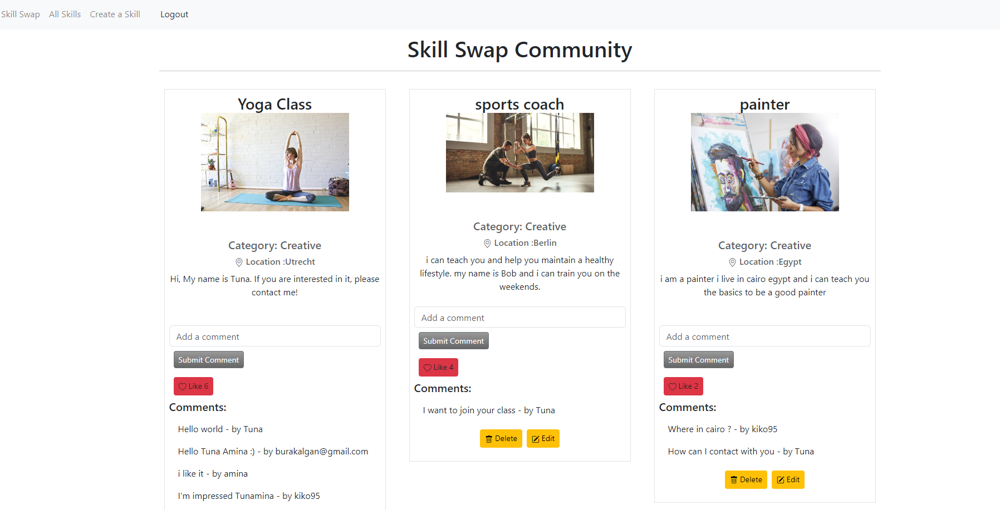

# Skill-Swap-Project MVP  :heart_eyes:
A platform where users can exchange skills or services. For example, someone who's good at graphic design could swap their skills with someone who can teach them guitar. Users can create profiles, list their skills, and interact with others through likes and comments to arrange skill exchanges.

#In order to install all dependencies, and then run the application, type the following commands in your console:

-npm install
-npm run dev

# How to run this app in your environment:
The images uplouded are stored in Cloudinary, you might need to create an account (for free!).

#Create .env file to store your variables

PORT
SESSION_SECRET
CLOUDINARY_NAME
CLOUDINARY_KEY
CLOUDINARY_SECRET

Here is the link that you can check our web site :arrow_right:
 [Skill Swap]( https://skill-swap.adaptable.app/)
